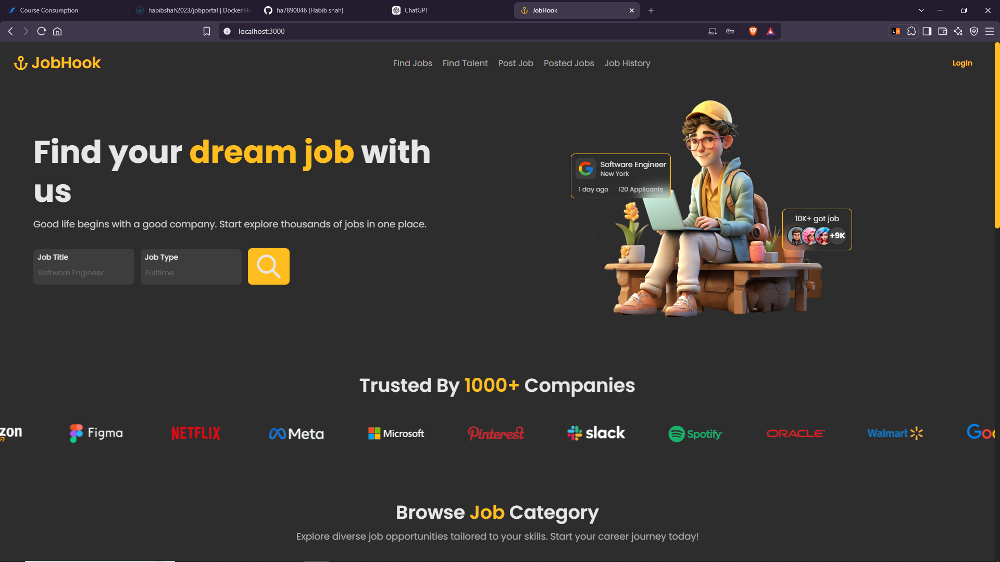

# 💼 JobFinder

A full-stack **Job Portal Application** built using **Spring Boot**, **React.js**, and **MongoDB Atlas**. The platform enables job seekers to search and apply for jobs while allowing recruiters to post and manage job listings.

## 🚀 Live Demo

- 🌐 Frontend: _Add your frontend deployment URL here_
- 🔗 Backend API: https://jobfinder-i84v.onrender.com
- 📂 Repository: https://github.com/ha7890846/JobFinder

---

## ✨ Features

### 👨‍💼 Job Seeker

- User Registration & Login (JWT Authentication)
- Email OTP Verification
- Browse and Search Jobs
- Apply for Jobs
- View Applied Jobs
- Update Profile

### 🏢 Recruiter

- Recruiter Registration & Login
- Post New Jobs
- Edit/Delete Jobs
- View Applicants
- Manage Job Listings

### 🔒 Security

- JWT Authentication
- Spring Security
- Password Encryption
- Protected API Endpoints

---

## 🛠️ Tech Stack

### Frontend

- React.js
- TypeScript
- Redux Toolkit
- Axios
- React Router
- Bootstrap

### Backend

- Spring Boot
- Spring Security
- Spring Data MongoDB
- JWT Authentication
- Maven

### Database

- MongoDB Atlas

### Deployment

- Render (Backend)
- Docker
- MongoDB Atlas

---

## 📂 Project Structure

```text
JobFinder/
│
├── backend/
│   ├── src/
│   ├── Dockerfile
│   └── pom.xml
│
├── frontend/
│   ├── src/
│   ├── public/
│   └── package.json
│
└── README.md
```

---

## ⚙️ Environment Variables

### Backend

Create a `.env` file:

```env
MONGODB_URI=your_mongodb_connection_string
MONGODB_DATABASE=jobportalDB

MAIL_USERNAME=your_email@gmail.com
MAIL_PASSWORD=your_app_password
```

### Frontend

```env
REACT_APP_API_URL=http://localhost:8080
```

For production:

```env
REACT_APP_API_URL=https://jobfinder-i84v.onrender.com
```

---

## 🐳 Running with Docker

Build the Docker image:

```bash
docker build -t jobfinder .
```

Run the container:

```bash
docker run --env-file .env -p 8080:8080 jobfinder
```

---

## 💻 Running Locally

### Backend

```bash
cd backend
mvn spring-boot:run
```

### Frontend

```bash
cd frontend
npm install
npm start
```

---

## 📡 API Endpoints

| Method | Endpoint           | Description   |
| ------ | ------------------ | ------------- |
| POST   | `/auth/register`   | Register User |
| POST   | `/auth/login`      | Login         |
| POST   | `/auth/send-otp`   | Send OTP      |
| POST   | `/auth/verify-otp` | Verify OTP    |
| GET    | `/jobs`            | Get All Jobs  |
| POST   | `/jobs`            | Create Job    |
| PUT    | `/jobs/{id}`       | Update Job    |
| DELETE | `/jobs/{id}`       | Delete Job    |

---

## 📸 Screenshots



- Home Page
- Login
- Dashboard
- Job Listings
- Recruiter Dashboard

---

## 📈 Future Improvements

- Resume Upload
- Company Profiles
- Job Recommendations
- Interview Scheduling
- Admin Dashboard
- Notifications

---

## 🤝 Contributing

Contributions are welcome!

1. Fork the repository.
2. Create a feature branch.
3. Commit your changes.
4. Push the branch.
5. Open a Pull Request.

---

## 📄 License

This project is licensed under the MIT License.

---

## 👨‍💻 Author

**Harsh Agrawal**

- GitHub: https://github.com/ha7890846
- LinkedIn: https://www.linkedin.com/in/habib2023/
